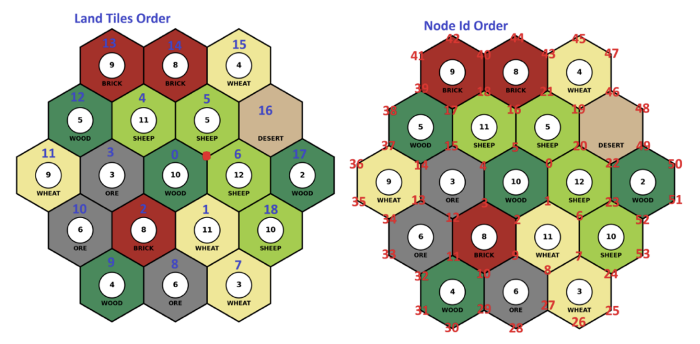
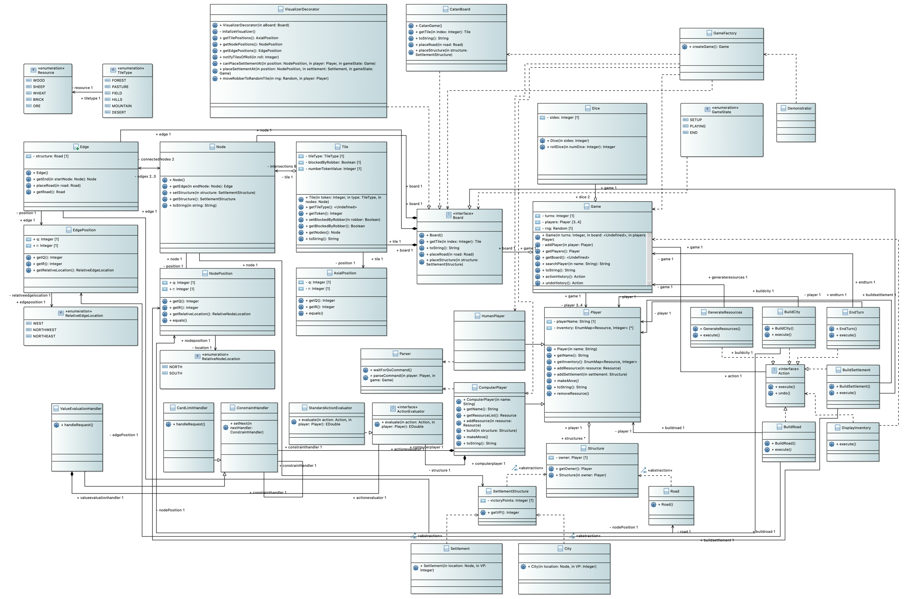

# Catan Game Simulation
 
**Project Tracking:** [Kanban Board](https://github.com/users/Anasthecode/projects/1)

**Names:** 
- Michael Mondaini [@SharkieBite](https://www.github.com/SharkieBite)
- Anas Abdul Aal [@Anasthecode](https://github.com/Anasthecode)
- Jack Wyand [@jackwyand](https://github.com/jackwyand)
- Uzair Khan [@UzairKhan12112005](https://github.com/UzairKhan12112005)

**Date:** March 20th, 2026
**Course:** SFWRENG 2AA4 - Software Design I - Introduction to Software Development

[](https://sonarcloud.io/summary/new_code?id=Anasthecode_2AA4-Catan-Game)

---------------------------------------------------------

This is the repository for a Java-based Catan simulation made for the SFWRENG 2AA4 (Software Design I) course at McMaster University. 

The simulation engine runs a full game between a mix of human and computer-controlled agents, strictly enforcing the rules defined by the official Catan rulebook (including distance rules, connection rules, and resource costs). The game is driven by a Finite State Machine (`SETUP`, `PLAYING`, `END`) and features a robust Command Line Interface (CLI) that parses human input using Regular Expressions. The engine uses the Decorator design pattern to silently intercept board updates and export the live game state to JSON, allowing for real-time graphical rendering via a Python visualizer.

The engine utilizes several formal Object-Oriented Design Patterns, including:
* **Decorator:** Silently intercepts board updates to export live game state for real-time Python visualization.
* **Command:** Encapsulates game actions to provide full Undo/Redo history tracking.
* **Strategy:** Evaluates the mathematical value of AI moves without hardcoding logic into the player classes.
* **Chain of Responsibility:** Filters strict game constraints (like hand limits) before normal AI evaluation occurs.

## How to Run the Project

To fully evaluate the interactive CLI and the live visualizer, you will need to run the Java engine and the Python visualizer simultaneously in two separate terminal windows.

**Step 1: Start the Java Game Engine**
1. Download the latest jar file located in [Releases](https://github.com/Anasthecode/2AA4-Catan-Game/releases).
2. Run the jar file using the following command, replacing `<version>` with the current version of the game (e.g., `2.0.0`)
   ```bash
   java -jar catan_game-<version>.jar
   ```
3. Go to **Step 2** to setup the visualizer, or play in console by following the CLI prompts to take your turn as the Human player

**Step 2: Start the Live Python Visualizer**
1. Clone the visualizer repository while in the directory containing the `catan_game-<version>.jar` file and open the `/visualize` directory
   ```bash
   git clone https://github.com/ssm-lab/2aa4-2026-base.git
   cd 2aa4-2026-base/assignments/visualize/
   ```
2. Create and activate a python virtual environment
   ```bash
   python3.12 -m venv .venv
   source .venv/bin/activate
   ```
3. Install required dependencies
   ```bash
   pip install -r requirements.txt
   ```
4. Clone the catanatron repository
   ```bash
   git clone -b gym-rendering https://github.com/bcollazo/catanatron.git
   cd catanatron
   ```
5. Install dependencies for Catanatron
   ```bash
   pip install -e ".[web,gym,dev]"
   ```
6. Return to the visualizer directory and start the visualizer program
   ```bash
   cd ..
   python light_visualizer.py base_map.json --watch
   ```

## Functionality of the program:
- **Interactive CLI:** Allows a human player to interact with the game using natural text commands (e.g., `Build settlement 12`, `Roll`, `Go`, `List`).
- **Live Board Visualization:** Seamlessly exports the internal Java object state (Nodes, Edges, Owners) into a `TestingState.json` file to be rendered by the Python `catanatron` visualizer.
- **Rule Enforcement:** Validates all moves, preventing floating settlements, overlapping roads, or building without sufficient resources.
- **The Robber Mechanism:** Automatically triggers on a dice roll of 7, forcing players with more than 7 cards to discard half their hand, and allowing the roller to steal a random resource from an adjacent player.
- **Automated Opponents:** Computer agents dynamically assess the board state and randomly execute valid actions until a player reaches the victory point threshold.
- **Undo/Redo History:** Players can reverse and re-apply actions infinitely using the `undo` and `redo` commands, managed via the Command design pattern.
- **Rule-Based Machine Intelligence:** Computer agents dynamically evaluate the board and score potential moves (e.g., prioritizing Victory Points or hand-size management) using the Strategy pattern.
- **Strict Constraints AI:** The engine uses the Chain of Responsibility pattern to force AI players to resolve immediate threats (like holding >7 cards when a 7 is rolled) before evaluating standard moves.

## Board Layout & Coordinate System

Below is the mapping of our axial coordinate system, showing the specific Node IDs and Edge connections used by the engine and visualizer. When using the CLI (e.g., Build settlement 12), refer to this map for valid Node IDs.


## UML Class Diagram

Below is the updated architectural design of the game engine, highlighting the core patterns used to satisfy the Assignment 3 requirements (Command, Strategy, and Chain of Responsibility).


# Assignment 3 Checklist

## Technical Content
- [x] R3.1: Undo/Redo functionality implemented using the Command pattern.
- [x] R3.2: Machine Intelligence value evaluation implemented using the Strategy pattern (VP = 1.0, Build = 0.8, Card Drain = 0.5).
- [x] R3.3: Machine Intelligence constraints implemented using the Chain of Responsibility pattern.

## Delivery

### Software
- [x] Design patterns properly introduced to the design (UML updated).
- [x] Design patterns properly introduced to the implementation (Java Code).
- [x] Executable `.jar` attached to the GitHub Release.

### Management
- [x] SonarQube analysis passing and linked.
- [x] Kanban board updated with Assignment 3 tasks.
- [x] Commits linked to work items.

### Report
- [x] Task 1 Reflection written (Command Pattern justification).
- [x] Task 2 Reflection written (Strategy Pattern justification).
- [x] Task 3 Reflection written (Chain of Responsibility Pattern justification).
- [x] Final PDF Report submitted.
